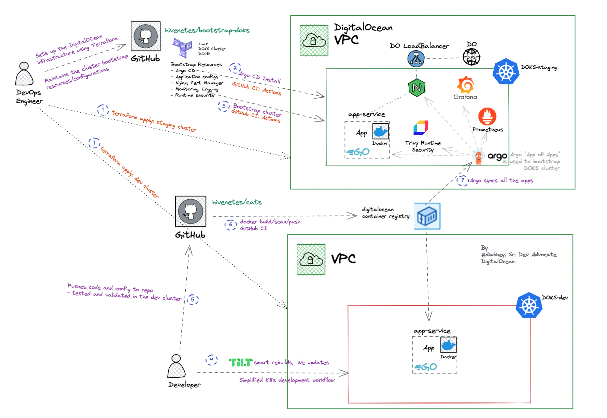

# Kubernetes Bootstrapper:  An extendable framework to set up production grade clusters

Bootstrapping a Kubernetes cluster using Terraform and Argo CD, powered by DigitalOcean.

The goal of this framework is to aid the [kubernetes adoption journey](https://try.digitalocean.com/kubernetes-adoption-journey/) of startups and SMBs. 

**Who is this for?**
- Kubernetes adopters
- SMBs who are looking to speed up the k8s adoption
- Builders and curious souls

## Prerequisites
- [Terraform CLI](https://learn.hashicorp.com/tutorials/terraform/install-cli)
- [DigitalOcean Cloud Account](https://cloud.digitalocean.com/)
- [DO Access Token (used by Terraform and GH Actions)](https://docs.digitalocean.com/reference/api/create-personal-access-token/)
- [k9s (optional)](https://k9scli.io/topics/install/)


## Set up the DO infrastructure
The terraform module will create a DigitalOcean Kubernetes cluster[(DOKS)](https://docs.digitalocean.com/reference/api/create-personal-access-token/) and a DigitalOcean Container Registry([DOCR](https://docs.digitalocean.com/reference/api/create-personal-access-token/))

```bash=
git clone https://digitalocean.github.io/k8s-adoption-journey/
cd infrastructure
terraform init && terraform apply --auto-approve
# var.do_token = <paste the DigitalOcean Access Token in the prompt>
```
> *The installation of Argo CD and child applications have been automated as part of Github Actions CI.* For manual trigger, copy and paste the commands in a terminal.

## Install Argo CD

We have leveraged [argocd: app of apps pattern](https://argo-cd.readthedocs.io/en/stable/operator-manual/cluster-bootstrapping/) to bootstrap Kubernetes cluster.

```bash
# Once the cluster is up and running
kubectl create namespace argocd
kubectl apply -n argocd -f https://raw.githubusercontent.com/argoproj/argo-cd/stable/manifests/install.yaml

# Get the argo password
kubectl -n argocd get secret argocd-initial-admin-secret -o jsonpath="{.data.password}" | base64 -d

# Expose the argocd-server and login with the credentials on localhost:8080
kubectl -n argocd port-forward svc/argocd-server 8080:80
```

## Let the bootstrap begin

```bash=
# metrics server
kubectl apply -f https://github.com/kubernetes-sigs/metrics-server/releases/latest/download/components.yaml
# install all child apps
kubectl apply -f https://raw.githubusercontent.com/hivenetes/bootstrap-doks/main/bootstrap/bootstrap.yaml
```

## Architecture

