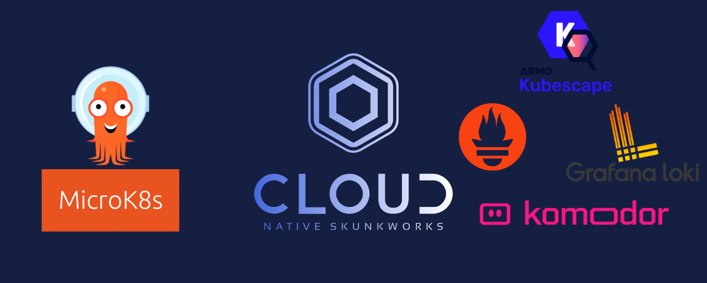
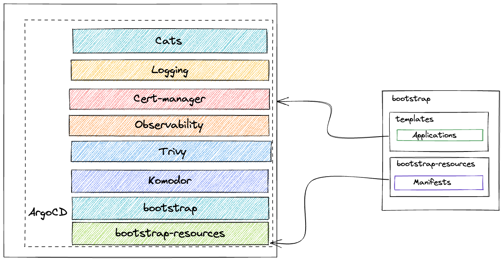
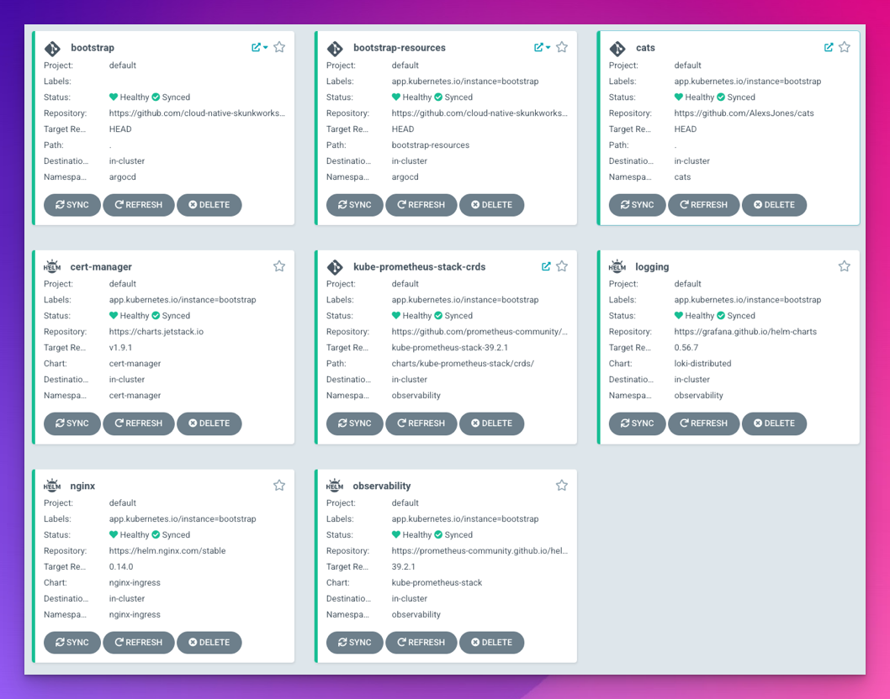

## gitops-cluster-bootstrap



This is an app-of-apps style start up repository for ArgoCD.

The goal is to setup a production like set of workloads ( observability, security and example applications ).

## Workloads

Workloads are deployed through ArgoCD in an app-of-apps style deployment.
Configuration of the application is done via the `bootstrap` root app that has it's own configuration within `values.yaml`. This is propagated into the child apps.

When looking at the wider business context, we see how the applications in this repository can feed more broadly back into the business.







## Prerequisites

- Spin up a Kubernetes cluster on your favourite cloud provider or hardware

- Setup argocd

```
kubectl create namespace argocd
kubectl apply -n argocd -f https://raw.githubusercontent.com/argoproj/argo-cd/stable/manifests/install.yaml
```
- Save the Argocd password
```
kubectl -n argocd get secret argocd-initial-admin-secret -o jsonpath="{.data.password}" | base64 -d
```

- Add this repository as a bootstrap cluster
```
kubectl apply -f bootstrap.yaml
```


### Custom values

Check `values.yaml` and adjust as required

## Credits

Prometheus CRD's when used with ArgoCD apply can get big, so here is a hack to get arond the sync errors
Thanks to [this](https://blog.ediri.io/kube-prometheus-stack-and-argocd-23-how-to-remove-a-workaround) guide.

### Software tooling BOM

- kubectl
- kubectx
- k9s
- jq
- kustomize
- helm
- sshuttle
