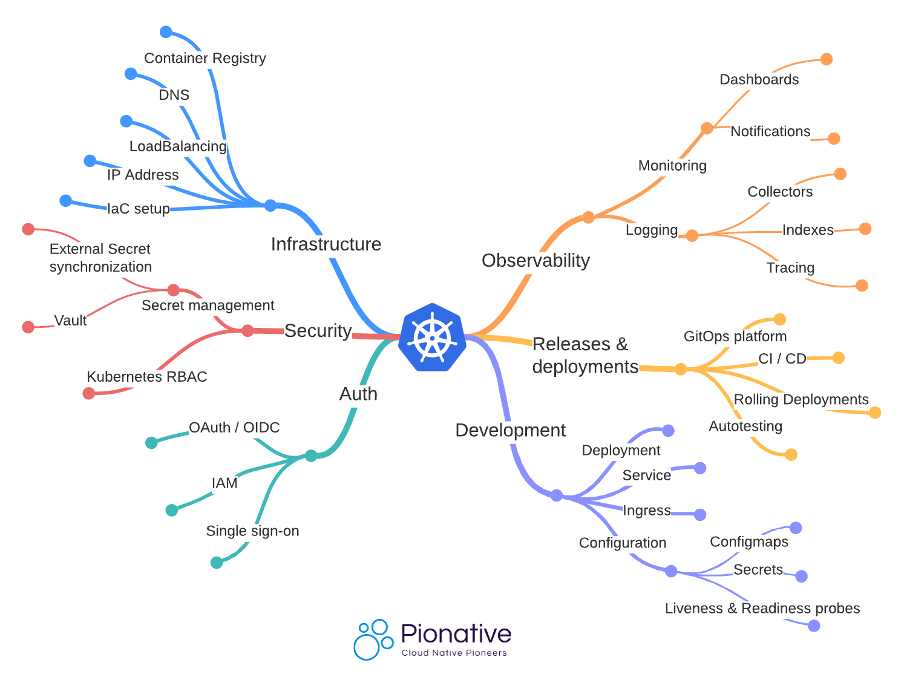
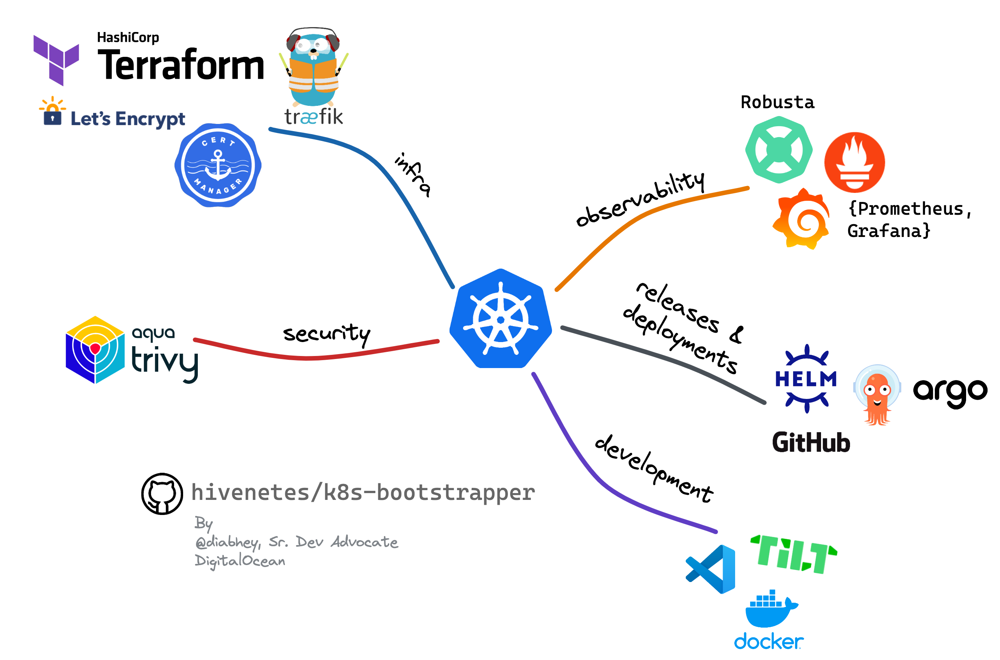
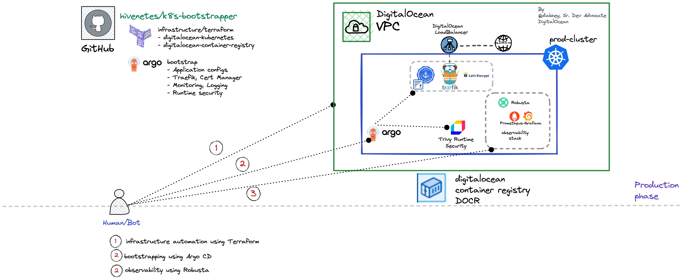

# Kubernetes Bootstrapper: An Extendable Framework to Set Up Production-Grade Clusters

## Introduction

"*Production-grade*" is a loaded term. What constitutes production readiness will vary according to your use case. While a Kubernetes cluster is production-ready the moment it is ready to serve traffic, there is a commonly agreed set of minimum requirements, as shown in the infographic below.

<p align="center">

</p>

With [many cloud-native solutions](https://landscape.cncf.io/) popping up daily, it can be pretty daunting for engineers and organizations to choose the "right" tools to build their tech. It becomes all the more challenging to integrate them to get to **day-2 operations ready** in Kubernetes.

## Kubernetes Bootstrapper

The [**k8s-bootstrapper**](https://github.com/hivenetes/k8s-bootstrapper) project is a customizable and extendable framework that aims to solve this problem by leveraging

- [Terraform](https://www.terraform.io/): Compose a production-ready infrastructure on DigitalOcean
- [Argo CD](https://argo-cd.readthedocs.io/en/stable/): Application configuration management and delivery using GitOps

This project integrates popular battle-tested open-source software and solutions that provide a production-grade out-of-box Kubernetes experience.

###  Target Audience

- Kubernetes adopters
- Startups/SMBs who are looking to speed up the Kubernetes adoption
- Builders and curious souls

<p align="center">

</p>

----

##  Overview

```bash
.
├── CODE_OF_CONDUCT.md
├── LICENSE
├── README.md 
├── argocd # Argo CD configurations (optional)
├── bootstrap # cluster bootstrapping using Argo CD
├── docs # documents and assets
├── infrastructure # infrastructure automation using Terraform
└── observability # set up observability stack 
```

###  Bootstrap the Kubernetes Cluster

Follow the guide in the order stated below:

1. [DigitalOcean Infrastructure Automation via Terraform](./infrastructure/terraform/README.md)
2. [Bootstrapping using Argo CD](./bootstrap/README.md)
3. [Set up Observability using Robusta](./observability/README.md)

Here is the overview of the architecture that we will set up:

<p align="center">

</p>

> **Note**:
Intended for experimentation/evaluation only.
You will be responsible for all infrastructure costs incurred by the used resources.

###  Tear down the Bootstrapped Cluster

Had fun trying out the *k8s-bootstrapper*? Time to say goodbye!

```bash
# Run
cd infrastructure/terraform
terraform destroy --var-file=bootstrapper.tfvars --auto-approve
# Bye Bye!
```

----

##  Media/Demos

- [Featured in akuity/awesome-argo](https://github.com/akuity/awesome-argo#ecosystem-projects)
- [Blog: Build your K8s framework](https://thecloudodyssey.com/build-your-own-kubernetes-framework)
- [Workshop: DigitalOcean Deploy Conference 2022](https://youtu.be/PfoB2e95VjQ)

###  Shout-out

This project takes inspiration from the fantastic work done by [Alex Jones](https://twitter.com/AlexJonesax) of [Cloud Native Skunkworks.](https://www.cloudnativeskunkworks.io/)
