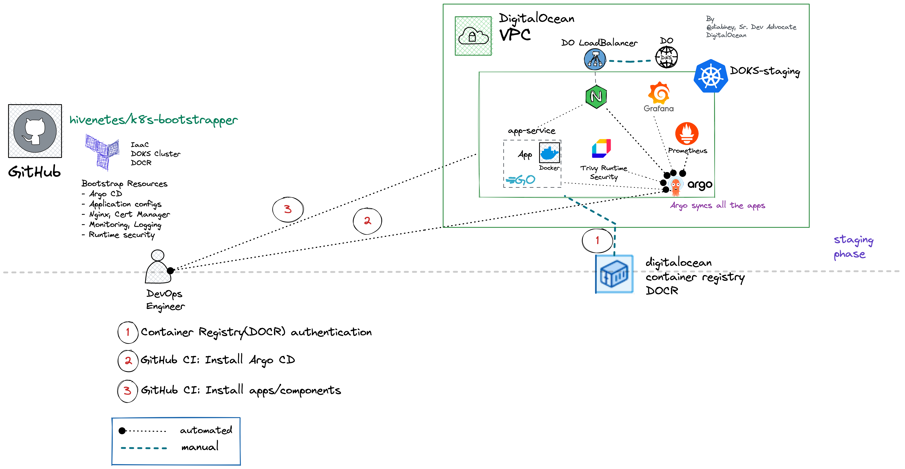
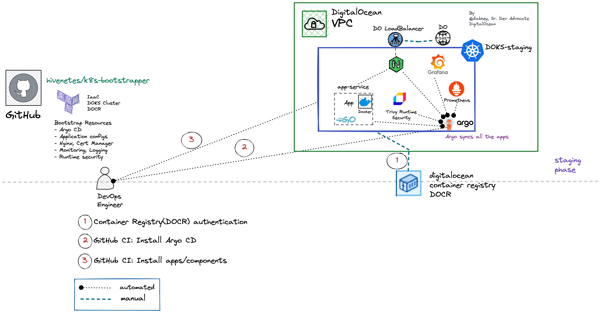

# Kubernetes Bootstrapper:  An extendable framework to set up production-grade clusters



Bootstrapping a Kubernetes cluster using Terraform and Argo CD, powered by DigitalOcean.

This framework aims to aid the [kubernetes adoption journey](https://try.digitalocean.com/kubernetes-adoption-journey/) of startups and SMBs. 

**Who is this for?**
- Kubernetes adopters
- SMBs who are looking to speed up the k8s adoption
- Builders and curious souls

## Prerequisites
- [terraform cli](https://learn.hashicorp.com/tutorials/terraform/install-cli)
- [doctl](https://docs.digitalocean.com/reference/doctl/how-to/install/)
- [kubectl](https://kubernetes.io/docs/tasks/tools/#kubectl)
- [DigitalOcean Cloud Account](https://cloud.digitalocean.com/)
- [DO Access Token (used by Terraform and GH Actions)](https://docs.digitalocean.com/reference/api/create-personal-access-token/)
- [k9s (optional)](https://k9scli.io/topics/install/)

---
## Set up the infrastructure on DigitalOcean 
The terraform module will create a DigitalOcean Kubernetes cluster[(DOKS)](https://docs.digitalocean.com/reference/api/create-personal-access-token/) and a DigitalOcean Container Registry([DOCR.](https://docs.digitalocean.com/reference/api/create-personal-access-token/))

```bash
git clone https://github.com/hivenetes/k8s-bootstrapper.git
cd infrastructure
# Initialise terraform modules
terraform init
# Modify the `variables.tfvars.example` as per your requirements
# To view the infra plan
terraform plan -var-file="variables.tfvars.example"
# To apply the infra plan
terraform apply -var-file="variables.tfvars.example" --auto-approve
# It takes around 4 minutes to spin up a cluster depending on the size of the nodes etc
# Once terraform has executed the plan, it will output the "cluster_id.”
# To update cluster credentials to kubeconfig and set up the current context run,
# Example: doctl kubernetes cluster kubeconfig save e74d2c45-c513-4c45-9ca3-f592ece1be76
doctl kubernetes cluster kubeconfig save <cluster-id>
```
### Authenticate with DigitalOcean Container Registry

Follow this [one-click guide](https://docs.digitalocean.com/products/container-registry/how-to/use-registry-docker-kubernetes/#kubernetes-integration) to integrate the registry with the Kubernetes cluster.

> **NOTE**:
Intended for experimentation/evaluation ONLY.
You will be responsible for all infrastructure costs incurred by the used resources.

---
### **Alternatively**: Set up infrastructure on DigitalOcean using [doctl](https://docs.digitalocean.com/reference/doctl/how-to/install/)

- [Set up DigitalOcean Kubernetes Cluster](https://github.com/digitalocean/Kubernetes-Starter-Kit-Developers/tree/main/01-setup-DOKS)
- [Set up DigitalOcean Container Registry](https://github.com/digitalocean/Kubernetes-Starter-Kit-Developers/tree/main/02-setup-DOCR)

---


## Install Argo CD: Declarative Continuous Delivery for Kubernetes

We have leveraged [Argo CD: App of Apps pattern](https://argo-cd.readthedocs.io/en/stable/operator-manual/cluster-bootstrapping/) to bootstrap the Kubernetes cluster.

```bash
# Once the cluster is up and running
kubectl create namespace argocd
kubectl apply -n argocd -f https://raw.githubusercontent.com/argoproj/argo-cd/stable/manifests/ha/install.yaml
# Get the argo password
kubectl -n argocd get secret argocd-initial-admin-secret -o jsonpath="{.data.password}" | base64 -d; echo
# Expose the argocd-server and login with the credentials on localhost:8080
kubectl -n argocd port-forward svc/argocd-server 8080:80
# Open the browser and go to localhost:8080 to access Argo CD UI
# Login with username: `admin,` password: `paste the value from the previous step.`
```

### DNS Setup for Argo CD (optional)
To access Argo CD via an FQDN, we need to configure a few things, 

**Prerequisites**
- A domain (example.com)
- [Personal Access Token](https://docs.digitalocean.com/reference/api/create-personal-access-token/) for [DigitalOcean DNS](https://docs.digitalocean.com/products/networking/dns/) access

```bash
# Disable internal TLS
# First, to avoid internal redirection loops from HTTP to HTTPS, the API server should be run with TLS disabled.
kubectl patch deployment -n argocd argocd-server --patch-file dns/no-tls.yaml

# Encode the access key to use it in Kubernetes Secret
echo -n 'dop_v1_4321...' | base64
```
Add the **encoded key** to the `/dns/lets-encrypt-do-dns.yaml` file
```yaml
apiVersion: v1
kind: Secret
metadata:
  namespace: cert-manager
  name: lets-encrypt-do-dns
data:
  access-token: ZG9wX3Y...
```

```bash
# Create the secret in the cert-manager namespace
kubectl create namespace cert-manager
kubectl apply -f dns/lets-encrypt-do-dns.yaml  
```
---
## Let the bootstrap begin

```bash
# Install industry-standard open-source tools to build a production-grade k8s stack
kubectl apply -f https://raw.githubusercontent.com/diabhey/argo-ochestrator/main/bootstrap/bootstrap.yaml
```

> **_NOTE:_**  Once the bootstrapping is completed successfully, we can access Argo CD via FQDN (example: argocd.heartbyte.io)

## Overview of the bootstrapped cluster


### Shoutout
This project takes inspiration from the fantastic work done by [Alex Jones](https://twitter.com/AlexJonesax) of [Cloud Native Skunkworks.](https://www.cloudnativeskunkworks.io/)
