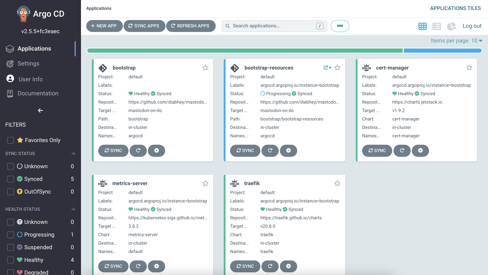

# Bootstrapping using Argo CD

## Introduction

The k8s-bootstrapper leverages the [Argo CD's App of Apps](https://argo-cd.readthedocs.io/en/stable/operator-manual/cluster-bootstrapping/) pattern. We use Helm to achieve this.

```bash
# Bootstrap
.
├── Chart.yaml # boiler plate chart.yaml
├── README.md 
├── bootstrap-resources # ingress/cluster issuer
├── bootstrap.yaml # parent app 
├── templates # child app templates (one file per app)
└── values.yaml # bootstrapper chart overrides: enable/disable apps
```

In this case, the parent app "**bootstrap**" is installed along with its *child apps* which are rendered from `templates/` and `bootstrap-resources/` directories.
By default, we have disabled most of the apps, but you can easily enable them by setting the flags in the [values.yaml](./values.yaml)

```yaml
# values.yaml
# Global
domain: 
storageClass: "do-block-storage"
# Application specific
bots:
  enable: false
guestbook:
  enable: false
kyverno:
  enable: false  
logging:
  enable: false
observability:
  enable: false
  pdkey:
  storageSize: 50Gi
  retention: 5d
traefik:
  enable: true  
trivy:
  enable: false
```

> **Note:** Save changes to the file as deemed fit and push the changes to the git repository. The bootstrapper follows a strict GitOps workflow, so all the changes need to be pushed to git to reflect the changes in the Kubernetes cluster.

## Bootstrapping

```bash
# Let the bootstrap begin!
kubectl apply -f https://raw.githubusercontent.com/hivenetes/k8s-bootstrapper/main/bootstrap/bootstrap.yaml
```

### Access the ArgoCD Web UI

```bash
# Get the argo password
kubectl -n argocd get secret argocd-initial-admin-secret -o jsonpath="{.data.password}" | base64 -d; echo
# Expose the argocd-server and login with the credentials on localhost:8080
kubectl -n argocd port-forward svc/argocd-server 8080:80
# Open the browser and go to localhost:8080 to access Argo CD UI
# Login with username: `admin,` password: `paste the value from the previous step.`
```

>Note: [**Accessing Argo CD via FQDN (optional)**](../argocd/README.md)



[**Next steps »**](../observability/README.md)
