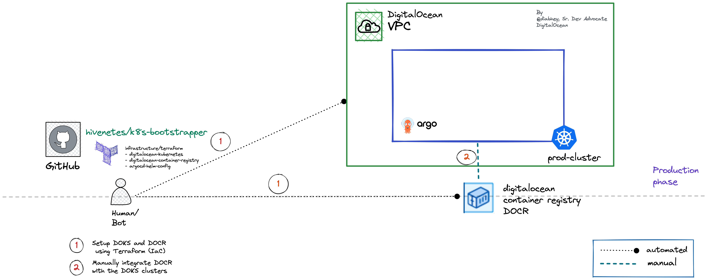

# Infrastructure Automation on DigitalOcean using Terraform

## Overview

This section describes the usage of [Terraform](https://www.terraform.io/) to provision the DigitalOcean infrastructure.

The Terraform code provided in this repository provisions the following:

- DigitalOcean Kubernetes cluster [digitalocean-kubernetes.tf](./digitalocean-kubernetes.tf)
- DigitalOcean Container Registry [digitalocean-container-registry.tf](./digitalocean-container-registry.tf)
- Input variables and main module behavior is controlled via [variables.tf](./variables.tf)
- Install and configure [Argo CD](https://argo-cd.readthedocs.io/en/stable/) via [argo-helm-config.tf](./argocd-helm-config.tf)

All essential aspects are configured via Terraform input variables. In addition, a [bootstrapper.tfvars.sample](./bootstrapper.tfvars.sample) file is provided to get you started quickly.

<p align="center">

</p>

## Requirements

- [Terraform CLI](https://developer.hashicorp.com/terraform/downloads)
- [doctl CLI](https://docs.digitalocean.com/reference/doctl/how-to/install/)
- [DigitalOcean access token](https://docs.digitalocean.com/reference/doctl/how-to/install/)
- [kubectl](https://kubernetes.io/docs/tasks/tools/#kubectl)

## Using Terraform to Provision Infrastructure on DigitalOcean

Follow the below steps to get started:

1. Clone this repo and change the directory to `infrastructure/terraform`
2. Initialize Terraform backend:

    ```shell
    terraform init
    ```

3. Copy and rename the `bootstrapper.tfvars.sample` file to `bootstrapper.tfvars`:

    ```shell
    cp bootstrapper.tfvars.sample bootstrapper.tfvars
    ```

4. Open the `bootstrapper.tfvars` file and adjust settings according to your needs using a text editor of your choice (preferably with [HCL](https://github.com/hashicorp/hcl/blob/main/hclsyntax/spec.md) lint support).
5. Use `terraform plan` to inspect infra changes before applying:

    ```shell
    terraform plan -var-file=bootstrapper.tfvars -out tf-bootstrapper.out
    ```

6. If you're happy with the changes, issue `terraform apply`:

    ```console
    terraform apply "tf-bootstrapper.out"
    ```

    If everything goes as planned, you should be able to see all infrastructure components provisioned and configured as stated in the `bootstrapper.tfvars` input configuration file.

7. Use [doctl](https://docs.digitalocean.com/reference/doctl/reference/kubernetes/) to update your Kubernetes context

    ```bash
    # <cluster-id> can be found in the output of the terraform module
    doctl kubernetes cluster kubeconfig save <cluster-id>
    ```

## Authenticate with DigitalOcean Container Registry

Follow this [one-click guide](https://docs.digitalocean.com/products/container-registry/how-to/use-registry-docker-kubernetes/#kubernetes-integration) to integrate the registry with the Kubernetes cluster.

[**Next steps »**](../../bootstrap/README.md)
