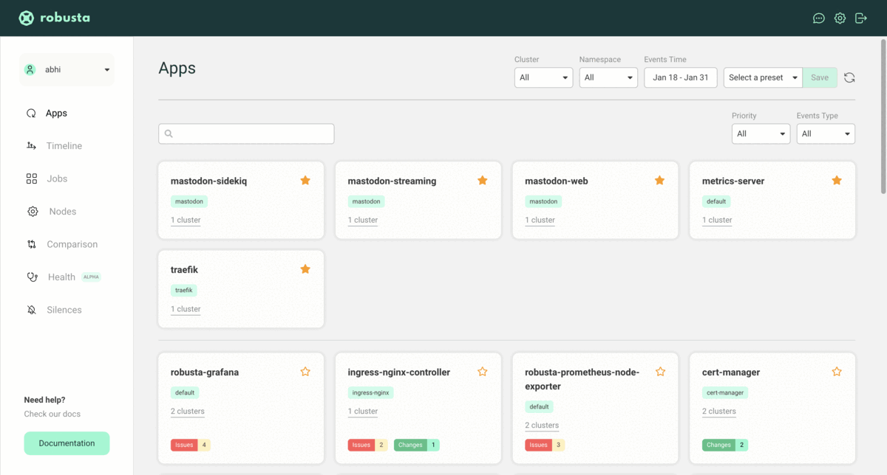

# Set up Observability Stack using Robusta

[Robusta](https://github.com/robusta-dev/robusta) is an open-source Kubernetes monitoring, troubleshooting, and automation platform which comes pre-baked with

- Embedded [Prometheus stack](https://github.com/prometheus-community/helm-charts/tree/main/charts/kube-prometheus-stack) with [pre-configured alerts](https://home.robusta.dev/features/builtin-alerts)
- A [web ui](https://home.robusta.dev/features/cluster-timeline) to see all alerts, changes, and events in your cluster, including timeline and root cause analysis
- Alert enrichment and automatic remediation through a powerful [automation engine](https://home.robusta.dev/features/automation-engine)
- [Multi-cluster observability](https://home.robusta.dev/features/multi-cluster-observability)


## Installation

1. Install the `robusta-cli`:
This step is needed to generate the values file for helm chart installation.

    ```bash
    # Requires python installed
    python3 -m pip install -U robusta-cli --no-cache
    ```

2. Generate a `generated_values.yaml` for Robusta Helm chart:

    ```bash
    # An interactive session where you can configure sinks 
    # such as receiving alerts to a particular Slack channel, MS Teams. 
    # This generates a `generated_values.yaml`

    robusta gen-config
    ```

3. Update DigitalOcean cluster credentials using `doctl`:

    ```bash
    # Notice: Adding cluster credentials to kubeconfig file found in "/Users/<username>/.kube/config"
    # Notice: Setting current-context to <cluster-context>

    doctl kubernetes cluster kubeconfig save <cluster-id>
    ```

4. Install Robusta with `helm`:

    ```bash
    helm repo add robusta https://robusta-charts.storage.googleapis.com && helm repo update
    helm install robusta robusta/robusta -f ./generated_values.yaml --set clusterName=<cluster-name>
    ```

[For more details on the installation »](https://docs.robusta.dev/master/installation.html)

## Access Robusta Web UI

Upon successful installation, head to [https://platform.robusta.dev/](https://platform.robusta.dev/) and sign in with the email/account used during the installation process.

Here is an example view of the Robusta SaaS platform


## Slack integration

 Receive [slack](https://docs.robusta.dev/master/catalog/sinks/slack.html) alerts to your private slack channel.


## Access Grafana Dashboards(optional)

Additionally, you can use [Grafana](https://grafana.com/oss/grafana/), which is part of the `kube-prom-stack` to visualize and query your data.

```bash
# Expose the robusta-grafana service
# log in with the credentials on localhost:3000

kubectl -n default port-forward svc/robusta-grafana 3000:80

# Open the browser and go to localhost:3000 to access Argo CD UI
# Login with username: `admin,` password: `prom-operator`
```


